# rfmesh — development plan + completion estimate (2026-05-18)

> **Update 2026-05-18 evening.** Council 4× APPROVE on this plan
> (architect / code-reviewer / rf-dsp-specialist / demo-integrity).
> Non-blocking recommendations folded in: G1 promoted to **MUST-HAVE**,
> E5 slide deck rebudgeted 1 d → 1.5-2 d, C4 reframed as
> signature-matching (not physics-recovery), Phase 2 step-4 gains an
> explicit `refusal_reason` rendering acceptance criterion. Phase 0
> and Phase 1 source landed on `main` as commits `1d4c592` (ADR-013
> ACCEPTED) → `a76d240` (settings) → `defd4d4` (WS-A-006 servo) →
> `6acf482` (WS-A-007a S2 firmware) → `a4576d3` (WS-A-005 RTLSDR
> Receiver port) → `481288c` (WS-A-007b LoRa beacon firmware). All
> six commits council-reviewed 4× APPROVE per role. Phase 1 source
> = 100 % done; remaining Phase 1 work is Maciej's bench (flash +
> Mast A/C `.iqx` re-capture). Revised completion ~82 %.

## Context

Maciej asked for two things: (a) familiarise with recent changes and lay out a thorough development plan, (b) estimate how far the project has come. This plan is written from a direct scan of the tree at `HEAD = 1b836db` (branch `main`, ~25 days from the BoTH3 demo target ~2026-06-12). The 2026-05-18-evening update notes above reflect six subsequent commits to `HEAD = 481288c`.

**Execution mode for this sprint.** Solo. Friend joins later; the WORK-SPLIT.md Friend track is paused. Lead-Opus authors all source; Maciej is bench operator (flash + smoke tests + merge gate). No Friend dependencies in the next sprint.

**Priority direction (set by Maciej).** Hardware-enabling tickets first, so smoke tests can run against real bench ASAP. ADR-013 is ACCEPTED in principle but propagation is deferred until after first hardware smoke tests pass — the current honesty fabrications are documented and the demo works on 1.1.0, so spending 2-3 h propagating a SCHEMA bump before smoke tests would just be debugging two changes at once. After smoke tests pass, ADR-013 propagation lands, then demo polish.

**Council caveat.** This remote planning session forbids spawning subagents, so the 4-agent council protocol (`CLAUDE.md` lines 23-49) cannot literally run inside this turn. The plan calls out each council pass that must happen at execution time on Maciej's normal lead-Opus session.

**Uncommitted state already on disk** (from `git status`): `.claude/settings.json` (adds permission allow/deny lists + `defaultMode: acceptEdits`) and `.claude/hooks/protect-frozen-paths.sh` (removes dead reference to `contracts-impact-analyzer` subagent). Both benign; flag for a `chore(settings)` commit when convenient, not load-bearing.

---

## Completion estimate — ~82 % to a credible BoTH3 demo (council-aggregated)

Per-workstream breakdown grounded in tree contents + `BACKLOG.md` + `SPRINT_LOG.md`. Numbers below were the **plan-authoring snapshot** at `HEAD = 1b836db`; the 2026-05-18-evening update column reflects post-commit state at `HEAD = 481288c`. Council aggregate (mean of architect / code-reviewer / rf-dsp / demo-integrity lenses) was 80-82 % at the plan-review pass; the WS-A-005 + WS-A-007b landings since then push the SDR track to its near-complete state.

| Track | %  (orig) | %  (post-commits) | Evidence |
|---|---|---|---|
| **WS-0 Lead — contracts + docs** | 95 % | 95 % | Frozen at `SCHEMA_VERSION=1.1.0`. 12 ADRs ACCEPTED (001-012), ADR-013 ACCEPTED (commit `1d4c592`, propagation deferred). Seven Binding Invariants in `AGENTS.md` §1. 8 advantages in `docs/ADVANTAGES.md`. SPRINT_LOG current. |
| **WS-A — SDR + simulator + firmware** | 55 % | **~85 %** | **Done:** `SyntheticReceiver` + 11 sim modules, IQ I/O, WS-A-006 servo host driver (`defd4d4`, 100 unit tests), WS-A-007a ESP32-S2 firmware (`6acf482`, 29 host C tests), WS-A-005 RTLSDR Receiver port (`a4576d3`, 16 unit tests), WS-A-007b LoRa beacon firmware (`481288c`). **Open:** WS-A-008 3-node bench (blocked on Maciej hardware). H1 bladeRF/Pluto coherent — parking. |
| **WS-B — DSP + ML** | 90 % | 90 % | **Done:** `l1.py` + `last_refusal_reason` (E1 ✅), array_manifold + array_covariance, l2_music, l2_mvdr (Capon per ADR-008), l2_null_steering + E4 golden, modulation classifier (CW/FHSS/FSK/LoRa), threats library. **Open:** G2 AIC/MDL source-rank detector (P1, cuttable). H4 real-IQ training — parking. |
| **WS-CD — fusion + CoT + node + ops** | 90 % | 90 % | **Done:** `Fuser` (Stansfield + MLE + covariance + GDOP + confidence + residuals + projection + geometry), CoT publisher (PyTAK + polygon ellipse + EmitterClass mapping), node runtime (asyncio + WifiBearer/LoRaBearer/BothBearer + envelope + dashboard pubsub + fusion service + capability detection + CLI), 10 ops panels + 3 layouts, `apps/demo-replay` (orchestrator + recorder + scenario loader + headless). **Open:** G3 `gdop_uncomputable_reason` + G4 `L1_REFUSED_PROMINENCE` — both queued for ADR-013 propagation. |
| **Hardware validation** | 40 % | 40 % | Phase C bench PASS at Mast C (14.9 dB F/B, 9° error, 3 km) — biggest risk retired. 3-node simulator end-to-end smoke produces 2 fixes. Mast A + C `.iqx` re-capture scheduled 2026-05-19. WS-A-008 3-node bench blocked on Maciej flashing WS-A-007a/b + capturing `.iqx`. |
| **Demo polish** | 85 % | 85 % | 15 jury Q&A entries (Q1-Q15), step-4 contingency re-anchored to A3 + Phase C artifacts (E5 ✅), demo-replay artifacts committed. Slide deck stub still nominal-only (rebudgeted 1.5-2 d in Phase 3 per demo-integrity council rec). |

**Code mass at plan authoring:** 31 245 LoC; 411 test functions; 521 passing. **At `HEAD = 481288c`:** ~3.7 kLoC added (servo 3286 +, firmware 6679 +, RTLSDR 831 +, beacon 622 +); 637 tests pass + 5 hardware-skipped + 2 deselected; mypy strict + ruff + lint-imports (6 contracts KEPT) all clean.

**What "82 %" means.** Software MVP done; SDR + servo + firmware sources all merged. The remaining ~18 % is concentrated in: (a) **Maciej's bench** — flash WS-A-007a/b + Mast A/C `.iqx` re-capture, (b) **WS-A-008** 3-node bench bring-up, (c) **ADR-013 propagation** (8 commits post-smoke), (d) **slide deck** (E5 expanded), (e) **integration rehearsal cycles**. None of those is a research risk — all execution.

---

## Solo sprint plan — 3 phases over the next 25 days

```mermaid
flowchart TD
    P0[Phase 0 — TODAY<br/>ADR-013 mark ACCEPTED in-file<br/>+ chore commit for .claude/ tweaks] --> P1

    subgraph Phase1 [Phase 1 — Hardware enablement, Days 1-7]
      direction TB
      P1a[Lead: WS-A-007a ESP32-S2 firmware port<br/>~3-4 h source, lift from macwed/rf-mesh]
      P1b[Lead: WS-A-007b LoRa beacon firmware<br/>~½ day source per lora_beacon_spec.md]
      P1c[Lead: WS-A-005 RTLSDR Receiver port<br/>~½-1 day, single-home _to_complex64]
      P1d[Lead: WS-A-006 servo host driver port<br/>~1 day, 6 modules + pyserial uvadd-request]
      P1e[Maciej: bench prep + flash WS-A-007a/b<br/>+ Phase C re-capture Mast A and C .iqx]
    end

    P1 --> P2

    subgraph Phase2 [Phase 2 — Smoke tests + ADR-013 propagation, Days 7-14]
      direction TB
      P2a[Maciej + Lead: WS-A-008 3-node bench bring-up<br/>against real RTLSDR + servo + firmware]
      P2b[Iterate any bugs that surface]
      P2c[ADR-013 propagation — 8 commits<br/>SCHEMA 1.1.0 → 1.2.0, council per commit]
      P2d[C3 mast_c_reference.yaml + C4 sim calibration<br/>from Maciej captures]
    end

    P2 --> P3

    subgraph Phase3 [Phase 3 — Demo polish + rehearsal, Days 14-25]
      direction TB
      P3a[E5 slide deck — 1.5-2 d, full content set]
      P3b[G1 Phase-C-failure replay scenario — MUST-HAVE<br/>Mast A .iqx integration test asserts L1 refusal]
      P3c[Integration rehearsal cycles]
      P3d[G2 AIC/MDL source-rank — if slack]
      P3e[G7 polar panel into DEBUG layout — if slack]
    end

    P3 --> DEMO[BoTH3 demo day ~2026-06-12]
```

### Phase 0 — Decisions logged (today, <30 min)

1. **Mark ADR-013 ACCEPTED in-file.** Single doc commit: change `**Status:** PROPOSED` → `**Status:** ACCEPTED` at `docs/adr/ADR-013-schema-version-1.2.0-honesty-extensions.md:3`. Add a note line under Status indicating propagation is queued post-smoke-test. No code change — the SCHEMA bump itself happens in Phase 2.
2. **`chore(settings)` commit** for the two staged `.claude/` tweaks. Clean working tree before Phase 1 starts.

No council pass needed for either — ADR-013 acceptance is the lead's call per `WORK-SPLIT.md` §5; settings commits are infra-only.

### Phase 1 — Hardware enablement source, Days 1-7

Lead-Opus authors all source; Maciej runs bench in parallel. Goal: by end of Day 7, the bench has WS-A-005/006 merged + firmware flashed + Phase C re-captures in repo.

**Ordering rationale.** Firmware first (P1a, P1b) so Maciej can flash early and have hardware ready while the SDR + servo ports land. RTLSDR port before servo port because servo bring-up depends on RTLSDR being on the bus for timing-coupled tests, but the port itself is software-only and can land mypy-clean independently.

1. **WS-A-007a ESP32-S2 firmware port** (`docs/tickets/WS-A-007-firmware-esp32-s2-port-and-lora-beacon.md`). 3-4 h source. Lift from `macwed/rf-mesh` C source per `INHERITED_CONTEXT.md` §1.1: USB-Serial-JTAG → TinyUSB CDC console driver swap, `sdkconfig.defaults` flags. Wire protocol unchanged. Land at `firmware/main/*.c`, `firmware/main/*.h`, `firmware/sdkconfig.defaults`. Council pass at PR. **Maciej flashes** once source lands.

2. **WS-A-007b LoRa beacon firmware** (per `lora_beacon_spec.md`). ½ day. Land at `firmware/lora-beacon/` (new dir). RadioLib + SX1276. **Maciej flashes** the SX1276 module once source lands.

3. **WS-A-005 RTLSDR Receiver Protocol port** (`docs/tickets/WS-A-005-rtlsdr-device-port.md`). ½-1 day. Lift ~415 LoC of `rtl_sdr`-subprocess logic from `macwed/rf-mesh` `io/devices/rtlsdr.py`. Re-seat on `rfmesh_contracts.protocols.Receiver`. Single-home `_to_complex64` at `packages/rfmesh-sdr/src/rfmesh_sdr/_iq_helpers.py`. Tests at `packages/rfmesh-sdr/tests/devices/test_rtlsdr.py` — software unit tests (no hardware required for mypy-clean landing). Council pass at PR.

4. **WS-A-006 servo host driver port** (`docs/tickets/WS-A-006-servo-host-driver-port.md`). 1 day. Lift 6 modules (`crc/cobs/protocol/messages/transport/driver`, ~1027 LoC) into the `rfmesh-servo` package. Requires `/uvadd-request` for `pyserial` per `AGENTS.md` §3 before lead approval. Council pass at PR.

**Maciej parallel track (no code, hardware ops):**
- Bench prep — RTL-SDR V4, ATK-10 Yagi, tripod, compass, laptop (per `NOTES_mast_recapture_2026-05-19.md`).
- Flash WS-A-007a once source lands.
- Flash WS-A-007b LoRa once source lands.
- **C1** Mast C `.iqx` + sweep JSON via `rfmesh-demo-record`.
- **C2** Mast A `.iqx` (flat-response signature for simulator calibration).
- Multi-height sweep 1.5/3/6 m AGL at Mast A (two-ray null characterisation).
- Polarisation cross-check at Mast C (vertical primary, horizontal sanity-check for 25 dB drop).

### Phase 2 — Smoke tests + ADR-013 propagation, Days 7-14

**Ordering rationale.** Run smoke tests against the proven 1.1.0 contract first — clean debug surface. Only after smoke tests pass do we layer the SCHEMA 1.2.0 bump on top, where the tripwire firing is *expected* mypy noise rather than a real regression hiding inside it.

1. **WS-A-008 3-node bench bring-up** per `docs/hardware/3-node-bench-bringup.md`. 1-2 days. Real RTLSDR V4 + ESP32-S2 servo + LoRa beacon + fusion + dashboard + CoT-to-ATAK. Iterate any bugs surfaced; fix at the package level, council pass each fix.
2. **C3** `scenarios/mast_c_reference.yaml` from Maciej's C1 capture geometry. 3 h post-capture-in-repo. Pure config; no DSP change.
3. **C4** Simulator multipath calibration vs Mast A flat response. ½ day in `packages/rfmesh-sdr/src/rfmesh_sdr/simulator/channel.py`. Calibrate `two_ray_ground + multipath_fir + log_normal_shadowing` parameters against the captured null. **Framing note (rf-dsp council):** this is **signature-matching, not physics-recovery** — 5 free channel parameters vs 1 observed null-depth signature is under-constrained; ½ day yields a *consistent* parametrisation (reproduces the Mast A signature), not a *unique* physics fit. SPRINT_LOG must phrase the outcome accordingly.
4. **ADR-013 propagation — 8 commits, ~2-3 h.** Council pass per commit.
   - `version.py` — bump `SCHEMA_VERSION` 1.1.0 → 1.2.0, update `SchemaVersionT = Literal["1.2.0"]`. **This commit alone fires the workspace mypy tripwire** — every subsequent commit clears one consumer.
   - `enums.py` — add `Capability.L1_REFUSED_PROMINENCE`.
   - `messages.py` — add `FixEvent.gdop_uncomputable_reason: str | None` + `BearingReport.refusal_reason: str | None` (both default None, both with full docstrings per ADR-013).
   - Contracts tests — bump stale-baseline in `test_schema_version_tripwire.py` from `"1.0.0"` → `"1.1.0"` to preserve the stale-rejection semantics.
   - `fuser.py:236-243` — replace fabricated `gdop_value` with populated `gdop_uncomputable_reason` + sentinel value, plus filter `L1_REFUSED_PROMINENCE` reports from `fuse()` input. **Filtering rule (code-reviewer council):** drop-from-fix, NOT drop-from-wire — `BearingReport` with `method == L1_REFUSED_PROMINENCE` must still arrive at the dashboard so `panels/bearings.py` can render the refusal symbol; only `Fuser.fuse()` skips it as an input.
   - `panels/fix.py` — render `gdop_uncomputable_reason` when set; render `gdop` numeric otherwise.
   - `panels/bearings.py` — render refusal symbol (e.g. dashed wedge or × at node) instead of sigma-wedge when `method == L1_REFUSED_PROMINENCE`. **Explicit acceptance criterion (demo-integrity council):** the `refusal_reason` string is rendered **verbatim** adjacent to the refusal symbol (`prominence-gate`, `saddle`, etc.) so the operator gets a glanceable cause in 10 s.
   - `INTERFACES.md` — §0 SCHEMA pin to 1.2.0, §1 Capability table adds `L1_REFUSED_PROMINENCE`, §3 dictionary entries for `gdop_uncomputable_reason` + `refusal_reason`.
5. **Sprint-log entry** summarising Phase 2 — bench result, ADR-013 propagation commits, any bugs found + fixes.

### Phase 3 — Demo polish + rehearsal, Days 14-25

1. **E5 expanded** — slide deck. Pairs with existing `docs/demo/script.md` (demo flow + 15 Q&A already exist). **Rebudgeted 1.5-2 d** (was 1 d) per demo-integrity council recommendation: full RF/EW-jury content set requires problem statement + architecture diagram + 8 advantages + Phase C bench result + expected demo outcome with honest error budgets + dual-use null-steering A/B slide (ARCHITECTURE.md §7) — 1 d ships nominal-only, jury reads it as marketing. Slack pulled from optional G7/G2.
2. **G1 Phase-C-failure replay scenario — MUST-HAVE** (was *if-slack*; rf-dsp council promoted). Mast A `.iqx` integration test that asserts the L1 prominence gate refuses (Mast A's 1.96 dB front-back signature is the canonical refusal regression anchor). 3 h. Required, not optional: defends the 10 m height choice in `three_node_trench.yaml` by demonstrating the system *honestly refuses* in the failure regime, not just succeeds in the easy regime. Lands once C2 (Mast A capture) is in repo.
3. **Integration rehearsal cycles** — run 3-node bench-validated demo end-to-end repeatedly, fix surfaced bugs. No new features; bug-fix iteration only.
4. **G7 polar panel into DEBUG layout** — `BearingScanPanel` exists (commit `59d6acc`) but isn't in any default layout because `PanelSpec` doesn't support `projection="polar"`. ½ day to extend `PanelSpec` and wire into `DEBUG_LAYOUT`. Only if slack (now reduced — slack pulled into E5 + G1).
5. **G2 AIC/MDL source-rank detector** for L2 MUSIC. ½ day pure-DSP; new function in `rfmesh-dsp` with golden test per WD-2. Cuttable — only if slack. RF-DSP council confirmed the deferral is sound: BoTH3 Challenge 2 is single-emitter geolocation, so a jury can ask "what if two emitters" and the honest answer is "v1.0.0 ships single-source MUSIC; multi-source is post-event".

### Out of scope for this 25-day window (per `WORKSTREAMS.md` §5 parking lot)

TDOA, vehicular/mobile DF, FiberSense, hardened enclosures, multi-week L3 training pipeline, H1 bladeRF/Pluto coherent (parking until partner-pool hardware on-site), H2 per-array calibration (depends on H1), H3 WinTAK/iTAK, H4 L3 training for POLE21/VOLNOREZ, G8 `rfmesh-find-reference` CLI. None of these block a credible demo.

---

## Critical-path summary (one paragraph)

**Demo ships if four things land:** (1) Phase 1 source (WS-A-005 + WS-A-006 + WS-A-007a + WS-A-007b) within **Days 1-7**, paired with Maciej's bench prep + flashing + `.iqx` captures, (2) WS-A-008 3-node bench-validated end-to-end within **Days 7-10**, (3) ADR-013 propagation against the working bench within **Days 10-14**, (4) slide deck + 2-3 rehearsal cycles within **Days 14-25**. The single biggest schedule risk is bench-bring-up bugs eating more than 2 days; mitigation is that the simulator-side smoke at commit `794fa75` already produced 2 fixes against the 3-node trench scenario, so the software path is pre-validated.

## Critical files to read before executing

- `docs/BACKLOG.md` — Tier F/E/C/G/S/H, ticket cross-references.
- `docs/SPRINT_LOG.md` — latest entries 2026-05-18 daytime + overnight.
- `docs/adr/ADR-013-schema-version-1.2.0-honesty-extensions.md` — the 8-step propagation plan + open question on `refusal_reason`.
- `packages/rfmesh-fusion/src/rfmesh_fusion/fuser.py:236-243` — the GDOP fabrication site G3 fixes.
- `packages/rfmesh-dsp/src/rfmesh_dsp/l1.py` — `last_refusal_reason` plumbing G4 promotes to wire.
- `docs/tickets/WS-A-005-rtlsdr-device-port.md`, `WS-A-006-servo-host-driver-port.md`, `WS-A-007-firmware-esp32-s2-port-and-lora-beacon.md` — drafted ticket scopes.
- `SALVAGE_AUDIT.md` Parts 1, 2, 4d — what to lift from `macwed/rf-mesh` for firmware/servo/RTLSDR.
- `INHERITED_CONTEXT.md` §1.1, §3.1, §5 — ESP32-S2 port scoping, Phase C status, regression anchors.
- `docs/hardware/3-node-bench-bringup.md` — bench recipe for Phase 2.
- `lora_beacon_spec.md` — LoRa beacon firmware spec.

## Verification (executed by lead-Opus per commit + once at the end)

- **Per commit:** `just verify` (= `just lint` + `just type` + `just test`) green; full output pasted in the conversation per `AGENTS.md` §5. Council pass per `WORK-SPLIT.md` §4 sequencing.
- **End of Phase 1:** `uv run mypy packages apps` clean; WS-A-005 + WS-A-006 ports land with software unit tests + golden tests per WD-2 (no hardware required). Firmware sources build under ESP-IDF (Maciej confirms).
- **End of Phase 2:** Hardware smoke — demo-replay scenario `scenarios/three_node_trench.yaml` runs against real bench end-to-end, producing 6 bearings + 2 fixes (matching the simulator smoke at commit `794fa75` qualitatively); CoT XML lands in ATAK; dashboard renders TRENCH 4×2 (incl. PseudospectrumPanel from D5). After ADR-013 propagation: workspace-wide `uv run mypy packages` re-clean against SCHEMA 1.2.0; `uv run pytest -m "not hardware"` returns to all-pass with the stale-baseline tests updated; one new test asserting `gdop_uncomputable_reason` populates correctly on a degenerate-geometry probe; one new test asserting `L1_REFUSED_PROMINENCE` reports are filtered by `Fuser.fuse()`.
- **End of Phase 3:** Full demo flow per `docs/demo/script.md` end-to-end without operator intervention beyond what the script calls for; 15 Q&A entries rehearsed; Phase C bench result + simulator artifacts both on slide.